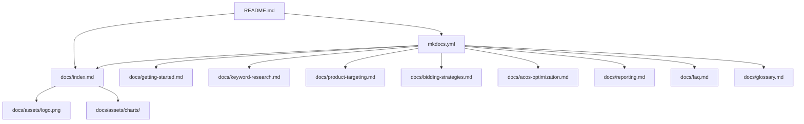

# Amazon-PPC-Student-Wiki - Code Dependency Graph

```mermaid
graph TD
    N0["README.md"]
    N1["mkdocs.yml"]
    N2["docs/index.md"]
    N3["docs/getting-started.md"]
    N4["docs/keyword-research.md"]
    N5["docs/product-targeting.md"]
    N6["docs/bidding-strategies.md"]
    N7["docs/acos-optimization.md"]
    N8["docs/reporting.md"]
    N9["docs/faq.md"]
    N10["docs/glossary.md"]
    N11["docs/assets/logo.png"]
    N12["docs/assets/charts/"]
    N0 --> N1
    N0 --> N2
    N1 --> N2
    N1 --> N3
    N1 --> N4
    N1 --> N5
    N1 --> N6
    N1 --> N7
    N1 --> N8
    N1 --> N9
    N1 --> N10
    N2 --> N11
    N2 --> N12
```